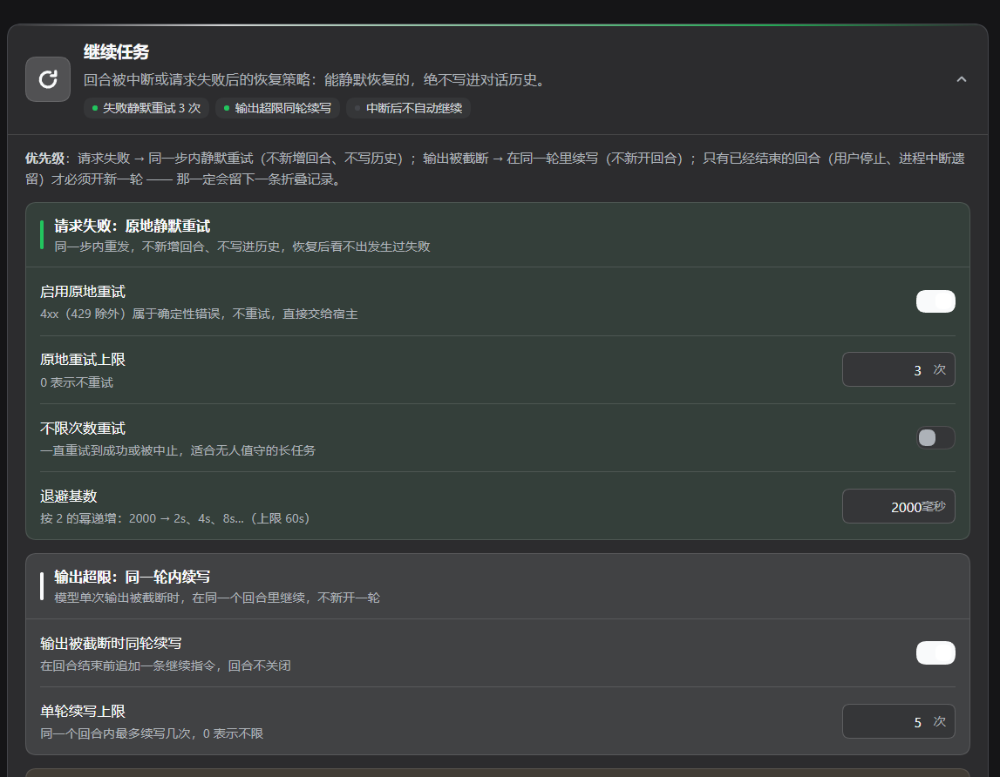
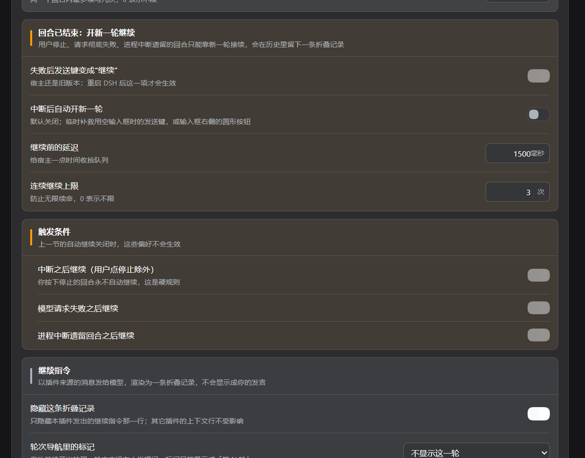

# dsh-restart-task

中文 | [English](README.en.md)

DeepSeek Harness **Web profile 插件**：输入框里的一个回合恢复控件、它背后的三段式恢复策略，以及一整套设置卡片。

所有设计只服务于一条原则：**恢复过的请求不该留下痕迹。**

| 层级 | 何时生效 | 对话记录里多出什么 |
| --- | --- | --- |
| 1. 同一步内重试 | 模型请求失败 | **什么都不多** —— 连一行都没有 |
| 2. 同轮续写（keep-alive） | 回复撞上输出上限 | 不新开回合；续写那一行被隐藏 |
| 3. 新开一轮继续 | 回合已经以失败收场 | 一个回合 + 一条折叠记录（默认隐藏） |

## 0. 适用版本

针对 **DSH 0.1.7-rc.1 及其后的 0.1.x** 编写，并且在 loader 会真正校验的地方写明了这一点：`peerDependencies["@deepseek-ai/dsh"]` 为 `>=0.1.7-rc.1 <0.1.8-0 || >=0.1.8-rc.1 <0.2.0-0`（强制字段），声明性的 `engines.dsh` 与之保持一致，插件自带的 `@deepseek-ai/schemastery` 为 `^3.18.4`（第一个支持 `.volatile()` schema 的版本，下面的配置模型依赖它）。

> 范围为什么要写成两段：node-semver 只有当范围里**某个比较符**与该版本的 `major.minor.patch` 元组完全一致、且自身带预发布标签时，才放行预发布版本。写成看着更宽的 `>=0.1.7-rc.1` 时，`0.1.8-rc.1` 这类下一条补丁线的 rc 会被**静默排除**，用户只会撞上 ERESOLVE（或 loader 直接跳过这个 bundle）。所以每个受支持的元组各占一段，并用 `<0.2.0-0` 把下一个大版本挡在外面 —— 0.2.0 上能否工作没有验证过，宁可让 loader 明确跳过。

版本之所以关键，是因为本插件赖以生存的两条接缝都变了：

- **设置不再是插件自己注册的命名空间。** 0.1.7 里 `settings.register(namespace, schema, { applies: 'live' })` 与 `settings.get(namespace)` 已被移除且没有继任者：插件的 `Config` 本身就是它的设置表单，而表单用 **profile 条目 id** 来寻址。见 §8。
- **插件消息不再是 `{ kind: 'plugin', plugin }` 包装。** 会话格式 v4 要求「生产者自有」的 `source.kind`；本插件用自己的包名。见 §4。

在更旧的运行时上，bundle 会在启动时被 loader 按兼容性规则直接跳过（并给出 `dsh plugin allow-version` 这条明确的豁免途径）—— 这是诚实的结局：上面两条接缝在那里并不存在。

## 1. 手动控制

当上一轮已经坏掉时，输入框动作区会出现一个圆形控件，位置就在产品自带发送键的左侧。

| 会话状态 | 控件行为 |
| --- | --- |
| 上一轮以 `error` / `aborted` / `interrupted` 结束 | **继续** —— 请宿主从中断处接着做 |
| 上报了 agent 级错误（`lastAgentError`） | **继续** |
| 只有最后一次**发送**失败（`promptError`） | **重发**上一条输入 —— 历史里没有可接续的内容 |
| 正在运行、空白会话、无事可做 | 不渲染 |
| 输入框里已经有内容 | 不渲染 —— 那条消息马上要发出去，不在它旁边提供「继续」 |

结果反馈就在按钮内部（转圈 / 绿勾 / 红色 `!`，说明文字在 `title` 里）。本插件渲染的任何东西都不插入布局：早先的版本在输入框下方加一行提示，结果每次状态变化都会让输入框抖动。

### 1.1 发送键本身（`sendBecomesContinue`，默认开）

「有继续可做」恰恰是产品发送键**最没用**的时刻：输入框为空时产品会把它置灰（`empty || blocked || uploadsPending`）并降到 40% 不透明度 —— 没东西可发，也没东西可点。所以圆形控件不是唯一的门：当**有继续可做**且**输入框没有别的内容可发**时，本插件把同一个动作交给发送键。

| 输入框 | 发送键 |
| --- | --- |
| 空，且上一轮中断 | 变为可用、警告色、圆形箭头、`aria-label="继续上次任务"` —— 点一下即从中断处继续 |
| 你正在输入 | 不动：它照旧是发送键，送你写的内容 |
| 智能体正在运行 | 不动：它照旧是产品的 停止 / 排队发送 / 插话发送 |

机制上，这是本插件唯一写入产品元素的地方，而且写得很克制：

- 输入框的主按钮是 **inline JSX、没有席位**（composer 只开放 `conversation.input.{left,right,model,attachments,activity,dock,overlay,permission,plan}`，没有 submit 席位），所以遍历只给**那个元素**打上本插件自己的属性 `data-dyn-continue="1"`，外观全部由本插件样式表负责；**从不触碰 React 拥有的 class**。
- **只接管产品用不了的那个控件** —— 判据是它自己的 `disabled`。这正是「你正在输入时它仍是发送键」的原因。接管即清掉 `disabled`；React 若写回，观察器会把接管补上。但**正因为接管清掉了它自己据以判断的信号**，遍历每轮都会重新读**草稿本身**，点击的那一刻还会再读一次：输入框一旦有内容，接管立即放手、产品原本的标签恢复、你的消息正常发出去。一个在输入框非空后仍然赖着不走的接管，会把「你写的消息」变成「继续旧任务」—— 那比不接管更糟。
- 点击在 **`document` 的捕获阶段**拦下并就地终止：产品的处理器挂在 React 根容器（更靠下），所以发送路径不会同时触发；窗口里其它点击一律放行。
- 动作**不重写**：接管后的按钮点击的是本插件自己的圆形控件（接管期间被 CSS 隐藏但仍在 DOM 里），两者共用同一个 busy 闸门、同一个双击围栏、同一份结果反馈 —— 按钮会跟着变绿 / 变红 / 转圈。
- 交还时移除属性、恢复产品原本的 `aria-label`，并恢复产品对**空输入框**的判定（`disabled`）：不恢复的话，按钮会以「可用但无事可做」的状态留在那儿，之后再也无法通过它提供继续。输入框里**有**内容时则保留产品渲染的状态，因为那条消息正是必须能发出去的东西。
- `hideContinueRow` 与这个开关互相独立，卡片里都能关掉。关掉接管后，圆形控件是唯一的入口，发送键则完全保持产品原样。

已知边界：它读的是产品渲染而不是声明式 API，若某版本改了主按钮的 class 或去掉 `data-composer-card`，接管会静默停止（不会报错，圆形控件照常工作）；在产品因自身原因禁用发送键的少数状态（有上传在跑、等待授权）下，接管同样会生效；接管期间产品自带 tooltip 仍显示「发送消息」（可访问名与 `title` 是本插件的）；**Enter 键刻意没动** —— 产品把它注册为只读固定动作，劫持它会让「空草稿 + 回车」变成不请自来的开工。

## 2. 第 1 层 —— 同一步内重试（默认开，不可见）

`agent/request-error` 是**瀑布（waterfall）**：监听器返回 `{ kind: 'retry' }` 且不调用 `next()`，就会让循环**就地重跑同一步**。本插件先按自己的退避等待（`retryBaseDelayMs × 2^attempt`，上限 60s），然后认领这次恢复，最多 `maxRequestRetries` 次 —— 或打开 `retryForever` 无限重试。

过程中不向会话追加任何东西 —— 没有指令消息、没有额外回合、没有重试行 —— 所以「失败后成功」的请求在对话记录里和一次成功完全一样。确定性客户端错误（4xx，429 除外）在任何预算被考虑**之前**就交给下游，因此「无限重试」也不会把错误的 API Key 变成死循环。每步的计数器在 `turn/end` 清空。

产品自带的 `dsh-llm-retry` 也监听 `agent/request-error`，而 `dsh-base` 把它挂在本插件**之前**，所以它在更上游：先用自己的策略（普通模式 5 次、自己的退避），耗尽后才用 `next()` 委派，此时本插件的预算才开始。两套预算因此是**相加**的 —— 若希望更早放弃，请调低产品那一侧，或关掉本插件这一侧。

## 3. 第 2 层 —— 同轮续写（不新开回合）

当一步因为模型撞上输出上限而结束时，回合**即将**关闭。`agent/turn-stopping` 就是可以提出异议的边界：调用 `agent.steer(...)` 会在边界提交前把新输入放进收件箱，循环随即**在同一个回合内**再跑一步。

> 「回合即将关闭……提出异议的监听器会 steer（`agent.steer(...)`），机器重新读取收件箱：新的 steering 会再跑一步，谁都不会关闭回合。」
> —— `dsh-agent/lib/types/runtime-types.d.ts`，`agent/turn-stopping`

于是轮次数、轨道和历史都不移动。受 `maxTurnContinues` 约束（每回合），且仅当该步的结束原因真的是 `max-tokens` 时才触发 —— 这个原因取自实时 `agent/assistant-stream` 的 `finish` 帧，比边界早一帧，因此无需翻会话日志。

两条诚实限制：

- 该边界只在**正常**停止时到达。`aborted` 与 `error` 是经 `throw` 离开循环的，所以第 2 层对它们永不适用。
- 被 steer 的指令仍是一条落盘的 `user/message` —— 它渲染为一条折叠记录（见 §6），永远不会变成你的发言气泡。

## 4. 第 3 层 —— 新开一轮继续（默认关，可见）

当回合真的以失败收场时，继续动作会通过 `agent.followup` 发出一条**插件来源**的消息：

```js
{ role: 'user',
  content: [{ type: 'text', text: '<continue instruction>' }],
  source: { kind: 'dsh-restart-task', form: 'notice',
            summary: '继续上次中断的任务' } }
```

`source.kind !== 'user'` 是它不会变成用户气泡的原因：它渲染为一条折叠记录 —— 而且因为这条消息**开启了这一轮**，产品会把它渲染成「非人类触发」通知而不是上下文行（§6）。这个 kind 必须是**本生产者自己的名字**：会话格式 v4 要求生产者自有的 source kind，并拒绝已退休的插件命名空间包装（`kind: 'plugin'` + `plugin` 字段），后者只会在 v3→v4 转换既有历史时被抬升。写成旧形状会让整个回合失败并报 `format v4 message requires a producer-owned source kind`，因为继续消息是在该步能运行之前就被追加的。但它仍然**是一个新回合**，所以对话记录会多出那一行、轮次轨道会多出一格 —— 这正是 `autoContinue` 默认关闭、并提供手动控件按需使用的原因。

`resend`（手动、仅发送失败时）是唯一会发出用户文本的路径 —— 一条从未到达宿主的输入不在历史里，重发它是唯一可能有效的做法。它不注册乐观回显，因此不会出现两行。

## 5. 为什么已结束的回合不能就地继续

这是 agent 循环的结构性约束，不是缺 API。事实如下，备查：

- 新回合号只能是 `previous + 1`，并且总是以 `turn/start` 宣告（`dsh-agent-loop/lib/index.js`，`turn()`）。
- `turn/end` 在 `finally` 块里被追加，任何路径都会执行，所以坏掉的回合在任何插件听说它之前就已持久关闭。
- 每一条进入 step 的消息都以 `user/message` + `surfaceOp: 'append'` 追加；插件无法为「唤醒循环的那条消息」选择非追加的 surface op。
- 会话事件是只追加的：`Session` 接缝与持久化层都没有 remove / truncate / rewrite API，因此继续动作无法在事后被剪掉。（`dsh-rewind-plugin` 也不删除事件 —— 它追加*替换* surface，而替换副本只对模型可见。）
- `interrupted` 标记由崩溃**修复**路径写入，它在事后关闭一个孤儿回合；循环从不实时发出它，恢复会话也不会唤醒驱动。

所以「能否不新开回合就继续」的完整答案就是第 1、2 层；对已经结束的回合，第 3 层是唯一可能的做法。

## 6. 隐藏续写行

第 2、3 层的记录存在，是为了让*模型*读到指令；它们是管道，而 Chat 给它们只有两种形态 —— 两种都无法用样式表单独选中：

| 形态 | 何时 | 靠什么识别 |
| --- | --- | --- |
| 折叠的上下文行 | 消息没有开启该轮（第 2 层：被 steer 的步骤） | 一个**无值**的 `data-context-source` 属性，生产者名字是**文本** |
| 非人类触发通知（`data-chat-flow-kind="turn-trigger"`） | 消息开启了该轮（第 3 层、手动继续） | 什么都没有 —— 未知 source kind 连「请求触发」都区分不出来 |

所以 `hideContinueRow`（默认**开**）是一个小型的**对话记录遍历**，而不是一个选择器：凡是能被归到本插件名下的行都会被打上 `data-dyn-restart-row="1"`，再由一条条件样式隐藏本插件自己的标记：

```css
[data-chat-flow-kind="context"][data-dyn-restart-row="1"],
[data-chat-flow-kind="turn-trigger"][data-dyn-restart-row="1"] { display: none !important; }
```

归属有两条来源，且从不猜测：

1. 来源标签恰好等于本插件 `source.kind` 的上下文行。
2. 本插件所开回合里的触发通知行 —— 轮次来自实时会话事件窗口（`ownWakingTurns`），窗口由当前显示会话的输入框控件发布。回合的输入是在它的 `turn/start` **之后**追加的，绝不会在之前（持久顺序是 `turn/start(7)` → `user/message(kind: dsh-restart-task)` → …），所以一条消息恰好是它落入回合的**第一条输入**时，就说明这一轮由它开启。第 1、3 层经 next-turn 收件箱投递，这正是它们的行会成为触发通知的原因；第 2 层的 steer 由已开启回合的某个 step 认领，因此永远不是第一条输入，也永远不占轮次。窗口尚未就绪时该规则被跳过，规则 1 仍然覆盖第 2 层。

第二条来源是**累积**的，而第三条让归属覆盖整会话。客户端手里永远只是一段**分页**窗口，折叠一个已完成的回合或加载另一片历史都会把它换成更小的窗口；只按当前窗口重算的集合会忘掉它已经认出的回合，轨道标记就会回来，直到下一片历史到达。所以：

- 两条来源说过的任何内容都会记住，直到会话切换才清空；
- **宿主半边**注册了一个 session projection（`restartTaskRounds`：同一套规则，但折叠的是**整份日志**而不是一页），projection 接缝把它的值整份下发给客户端，浏览器半边再并入集合。这正是「事件根本没被加载」的那种回合能被归属的原因 —— 分页转录（`加载更早`）下屏幕上看不出那一轮是谁开的。

其它生产者的行 —— 时间上下文、`AGENTS.md`、技能、cron、子代理结算、目标回合 —— 永不打标、永不隐藏。遍历是幂等的（React 重渲染不会碰别人的属性），开关关闭或插件卸载时会清掉自己的标记，读不懂的视图就什么都不做，而不是去隐藏一个归属不明的行。因此「丢失归属」只是观感上的损失（某行继续显示），绝不会变成对别人行的错误猜测。

诚实说明：第一条规则读的是产品渲染而非声明式 API，所以某个版本改了 flow 属性或改了来源标签文案，遍历就会停止匹配（不会坏掉 —— 那行只是重新显示出来）；第二条与第三条只在宿主注册了 projection 时生效，没有该接缝的组装回退到纯窗口归属（那时未能加载的回合仍要等历史被加载才能归属）；另外这些规则不会碰第 3 层回合在轨道上的那一格（见 §7）。

## 7. 轮次轨道

第 3 层的继续是一个真实回合，所以轨道会为它多出一格 —— 而因为这一轮**没有人类提问**，那一格的悬浮卡只能退化成匿名的「第 N 轮 / Turn N」。这个退化不是插件能改的数据：轨道是 inline JSX、没有扩展点，而整会话的 `turnOutline` 投影只接受 `source.kind === 'user'` 的提问预览（`dsh-session-turn-outline/lib/types/projection.js`）。

因此 `continuedRailMarks` 把它当作呈现问题，提供三种模式：

| 模式 | 效果 |
| --- | --- |
| `hide`（默认） | 该轮的轨道标记（连同悬浮卡）不显示 |
| `preview` | 标记保留（仍可点击跳转）；悬停时不再显示「第 N 轮」，只显示该轮答案预览 |
| `keep` | 产品自身行为，完全不干预 |

机制上这是一次很小的 DOM 遍历，不是样式表技巧。轮次来自 `ownWakingTurns` 归属给本插件的**轮次集合**（§6）—— 是轮次本身，而不是被打标的行：第 2 层的 steer 会隐藏「人类自己那一轮」里的一行，但那一轮的轨道标记绝不是本插件该碰的。每个轨道标记通过它的可访问标签（它唯一的逐轮属性）匹配到轮次，然后按配置模式打标：

```css
[data-dyn-continued='hide'] { display: none !important; }
nav[data-dyn-continued-preview='1'] [class*='_previewPrompt'] { display: none !important; }
```

本插件自己那一轮的标记被打上 `hide`/`preview`，其它标记完全保持产品原样。因为 `hide` 是给标记本身 `display: none`，悬浮卡就失去了挂载对象：那一轮的「第 N 轮」提示根本不会出现。

只隐藏标记只做了一半。轨道的虚拟化会给这一轮**预留位置** —— 它按自己的测量结果决定标记容器的高度，且从不因隐藏而重排；产品本身也不写任何逐标记几何 —— 所以被隐藏的标记会在轨道中间留下一个空洞。因此遍历会**压实**屏幕上的内容：量出当前渲染出的标记之间的间距，把被隐藏标记之后的每一个标记上移一个间距，并让容器高度减去隐藏轮数。这两处都只是本插件自己的内联覆盖，每次遍历重算，一旦没有需要隐藏的标记或插件卸载就移除，轨道因此会回到产品原本画出的样子。

诚实限制：只能标记并压实视图真正渲染过的轮次（远离已加载窗口的轮次会在滚动到之后被处理）；标记是虚拟化的，所以任意时刻只处理轨道自身滚动窗口里的标记；它通过可访问标签匹配，因为标记本身没有轮次属性；轨道的 DOM 在 0.1.7 变了（标记容器里的 `button[data-index]`，没有逐标记位置包装），本遍历读的就是这个；压实是对产品自己会重算的几何做补偿 —— 一次重渲染会把标记放回虚拟化想要的位置，而下一次遍历（隔着一次 DOM 变动）会再次压实。

## 8. 设置卡片

**插件页 → dsh-restart-task**（侧边栏里由插件管理器拥有的那一页）。卡片注册进该页的 `plugins.bundle.config` 席位，键是 bundle 的包名（`dsh-restart-task`）—— 这是该页自己的契约（「自带配置的 bundle」），也是 0.1.7 重构后唯一保留的席位（旧的 `settings.plugin.item` 标签页已消失）。只有当宿主提供本插件的设置条目时才会注册，所以从未挂载该行的部署看不到本卡片的任何痕迹。

卡片拥有自己的全部外观：可折叠标题（带实时策略摘要）、四个分组、逐字段的「已自定义 / 恢复默认」，以及带写入状态和「全部恢复默认」的页脚。





| 字段 | 默认 | 含义 |
| --- | --- | --- |
| `retryFailedRequests` | `true` | 在同一个 step 内重试失败的请求（不可见） |
| `maxRequestRetries` | `3` | 同轮重试次数上限（`0` = 不重试） |
| `retryForever` | `false` | 忽略预算，重试到成功或中止 |
| `retryBaseDelayMs` | `2000` | 退避基数：2s、4s、8s… 上限 60s |
| `keepAliveOnMaxTokens` | `true` | 让被截断的回合保持开启，在回合内续写 |
| `maxTurnContinues` | `5` | 单个回合内允许续写几次（`0` = 不限） |
| `autoContinue` | `false` | 坏掉的回合之后自动开新一轮继续（可见） |
| `delayMs` | `1500` | 中断之后等待多久再继续 |
| `maxConsecutive` | `3` | 连续继续的轮数上限（`0` = 不限） |
| `onAborted` | `true` | *系统*取消（父 agent / hook）之后继续；用户主动停止永不继续 |
| `onError` | `true` | 模型请求失败之后继续 |
| `onInterrupted` | `true` | 崩溃遗留孤儿回合之后继续 |
| `sendBecomesContinue` | `true` | 输入框为空时，把继续交给产品发送键（见 §1.1） |
| `hideContinueRow` | `true` | 在 Chat 里隐藏本插件自己的折叠行 |
| `continuedRailMarks` | `hide` | 轨道如何呈现本插件继续出的轮次（`hide` / `preview` / `keep`） |
| `continueText` | （内置） | 发给模型的继续指令 |

`autoContinue` 关闭时，`onAborted` / `onError` / `onInterrupted` 会被禁用，因为它们只描述那一层何时触发。

### 值是怎么进出的（0.1.7 的配置模型）

设置命名空间已经不存在，所以接线是这样的：

- **宿主半边的 `Config` 就是表单。** 每个字段都标了 `.volatile()`，这是它能被实时编辑的前提；loader 随后给 `apply` 每个字段一个*引用*，`config.<field>.get()` 就是三层策略每次决策时读取的东西。一次写入在下一次中断时生效，无需重启，也不涉及任何插件事件。
- **表单用 profile 条目 id 寻址**，即 `restart-task` —— 本包 `cordis.patch.yml` 插入的那个 id。它*不是*包名，而浏览器半边无法 import 宿主半边的常量，所以两半和 patch 文件各写一遍；回归测试会断言三者一致。
- **写入经 `configForms.get('restart-task')`**（浏览器半边为该条目共享的表单）：快照给出*被服务*的表单值加原始用户层，逐字段 `set` / `unset`，底下是带版本号的改动队列。被拒绝的写入返回 `false`，冲突则重新读取宿主而不是覆盖它。
- **宿主不会再生成一个页面**：插件在可选的 `settings` 子上下文里注册 `settings.configure({ auto: false }, ctx.fiber)`。这个子上下文是刻意可选的 —— 没有设置域的组装仍然能跑三层恢复和输入框控件，只是卡片和两个对话记录遍历不出现。

### 当客户端与宿主不一致时

浏览器半边可能比正在运行的宿主新 —— 这是插件更新后、profile 重启前的常态。此时条目可能没有被服务，或缺少较新的字段，卡片会说明而不是让写入失败：宿主未提供的字段以只读显示「宿主还是旧版本：重启 DSH 后这一项才会生效」；宿主根本没有提供该条目时提示「宿主没有提供本插件的设置入口」；非回环页面（设置仅在该会话内存中）也会被标注。

## 结构

- `cordis.patch.yml` —— profile bundle patch，插入 `restart-task` 行；这个 id 同时就是设置条目 id，文件里的注释也这么写。
- `lib/index.js` —— 宿主半边：每个字段都 `.volatile()` 的 `Config`、同轮重试、同轮续写、可选的继续回合、`continue-task` 命令。
- `lib/client.js` —— 浏览器半边：`window.__ModuleLoader__.load` bundle，导出 `apply` + `inject`（`['slots', 'timer']`）、输入框控件、插件页卡片（挂在可选的 `configForms` 子上下文上），以及给本插件自己的行打标、呈现其继续出的轮次、并在输入框为空时把继续交给产品发送键的对话记录遍历。
- `restart-task.test.mjs` —— 回归测试（见下）。
- `screenshots.json` —— 市场详情页展示的 1–8 张截图（见 §8）；`docs/awesome-dsh-plugin-entry.yml` —— 提交或更新
  [`awesome-dsh-plugin`](https://github.com/awesome-dsh-plugin/awesome-dsh-plugin) 收录时复制过去的那一条目。截图刻意放在本仓库：
  换图只需往这里推一次，不用去那边提 PR、等维护者。

输入框控件的形状刻意用 `!important` 钉住：它住在产品的 composer 工具行里，那一行有自己的 button/svg 规则。设置卡片使用产品的 `--dsw-alias-*` token，并在不依赖任何东西的前提下匹配其卡片外观（`.5px` 边框、16px 圆角、14–16px 头部内边距）。两个注入的 `<style>` 标签都带 `data-plugin`，因为模块系统按该属性归属样式：没有归属的标签会被下一个物化的插件认领，并在*那个*插件卸载时被删掉。

有三处区域被直接断言 —— `lib/index.js` 的 `auto-logic`、`lib/client.js` 的 `core-logic`，以及宿主模块自身的导出 —— 所以出厂代码跑的就是被测的决策：

```sh
node dsh-restart-task/restart-task.test.mjs   # 305 条断言，两半都覆盖
```

测试分四层，因为移植到 0.1.7 时坏过三种方式，而行/轨道的呈现只能看它对文档的实际效果：

1. **规则** —— 重试预算（确定性 4xx、429、倍增、60s 上限、不限次）、保活门槛（只有 `max-tokens`、每轮上限）、回合级门槛（坏掉的原因、逐原因开关、连击上限）、对话记录读取（只认人类提问、坏掉与干净的结束）、开轮识别、控件模式选择、头部摘要文案。
2. **接线** —— 所有身份字符串一致（patch 条目 id ↔ 宿主 `ENTRY_ID` ↔ 客户端 `ENTRY_ID`，包名 ↔ bundle 席位键 ↔ 生产者 kind），每个 `Config` 字段都是 volatile 且每个被服务的字段都由卡片渲染，已退休的设置接缝、席位、选择器全部消失，行隐藏规则以本插件自己的标记为键，两个样式标签都写明归属。
3. **宿主行为** —— 真正 import `lib/index.js`，并用桩 Cordis 上下文驱动：命令只发一条生产者来源的消息；401 被委派而 500 等待后原地重试；等待中被停止则委派；被截断的一步在回合内 steer，而完成的一步不会；回合级继续只在开启时发生，且永不发生在用户停止之后，也永不越过连击上限。
4. **对话记录、轨道与发送键（桩 DOM）** —— 加载浏览器半边并应用到一份假 document 上：里面有一个本插件开的轮次、一个人类开的轮次（其中带着本插件的同轮 steer）、别的生产者的上下文行与触发通知，以及一个主按钮初始为禁用的输入框。结果是：本插件自己的行被打标而别人的没有；steer 行只靠来源标签就能认出，而触发通知需要会话窗口；本插件那一轮的轨道标记在 `hide` 模式下被隐藏、`preview` 模式下被标记，而人类那一轮与外部轮次的标记永不被动；发送键被接管、被点击（点击在产品看到之前就被截停，改由圆形控件执行）、在输入框有内容时不被接管、开关关闭后被交还；窗口缩小时（折叠/分页）不会把已经认出的轮次收回。事件夹具抄自真实的 `session.v4.jsonl`，包括决定归属的 `turn/start` → 消息顺序。

## 延伸阅读

下面这些页面是本插件依赖的接缝，方便逐条对照它声明的版本核对：

- [DeepSeek Harness](https://github.com/deepseek-ai/deepseek-harness) —— 运行时、插件契约，以及全文引用的各包：`dsh-agent`（Agent 外观与 `agent/request-error` / `agent/turn-stopping` 分发）、`dsh-agent-loop`（回合与 step 边界）、`dsh-settings`（配置表单）、`dsh-session-format`（v4 来源规则）、`dsh-client-ui-conversation`（输入框及其席位）、`dsh-client-ui-chat`（flow 行与轮次轨道）。
- `dsh-client-shortcuts` —— 本插件刻意不改绑的固定输入动作（`fixed.send` = `Enter`、`fixed.newline` = `Shift+Enter`、`fixed.complementary` = `Ctrl`/`Cmd+Enter`）；「忙时回车」到底是排队还是插话，是 `ui-conversation` 设置里的 `busyEnter`。
- `dsh-llm-retry` —— 挂在本插件上游、耗尽自身策略后委派给它的产品重试执行器。
- `dsh-client-ui-plugin-manager` —— 拥有 `plugins.bundle.config` 席位（本卡片注册的地方）的插件页。

## 模型体验

分层的模型可见性：

- **第 1 层**不可见：被重试的请求用同一段持久历史重建同一个 step，没有任何重试事件、延迟或提供方错误到达模型。
- **第 2 层**多出一条 `user/message`，其 `source.kind` 是本插件名：模型读到指令，人类读到一条折叠记录（默认隐藏）。
- **第 3 层**是一个新回合，唯一输入就是这条生产者来源的消息。因此模型看到的是一句「接着做」的指令，绝不会是用户原话的第二份拷贝。

#### KV Cache 影响

被重试与被继续的请求都会重建与它所恢复的那次尝试相同的前缀，因此在该提供方的规则下缓存复用得以保留。插件本身不贡献 token：不加工具 schema、不加系统提示词文本，除了第 2、3 层真正需要的那一条继续指令之外不加任何上下文。

## 开发说明

- **测试就是规格。** `restart-task.test.mjs` 从出厂源码里切出纯函数区域，并真正驱动宿主模块，所以某条规则不可能在这里通过而出厂代码另做一套。
- **事件夹具取自真实日志。** 决定归属的 `turn/start` → 消息顺序，是从一份真实 `session.v4.jsonl`（每批追加一个 zstd 帧）里读出来的 —— 在这之前，规则的第一版假设了相反的顺序，于是静默地什么都认不出来。
- **DOM 遍历读产品渲染是刻意的**，因为产品没有为它们作用的那些东西提供席位（折叠上下文行的来源是*文本*，触发通知没有任何来源属性，轮次轨道是 inline JSX，输入框主按钮也是 inline JSX）。每一处都被写成「读不懂就什么都不做」而不是猜，各自的边界都写在它旁边。

## 安装 / 移除

直接从本仓库安装（无需 registry）：

```sh
dsh plugin --profile web add github:zchuxi/dsh-restart-task
# 或：dsh plugin --profile web add https://github.com/zchuxi/dsh-restart-task
# 或从本地 checkout：dsh plugin --profile web add link:<路径不含空格>
# 然后重启 profile（宿主 + 页面）：宿主半边变了
dsh plugin --profile web remove dsh-restart-task
```

`desktop` 是 Electron 专属的 profile 名，CLI 会拒绝它；请改在插件管理器里用同一个 git 地址安装。

bundle 通过其 `dsh.bundle.patch` 清单字段加入 `dsh.profile.bundles`；移除依赖后，下一次启动就不再插入那一行。

> 本地 checkout 请放在**不含空格**的路径下。`dsh plugin` 会把参数经 shell 转发，含空格的路径会被拆成若干个错误依赖。

**环境要求。** DSH `>=0.1.7-rc.1 <0.1.8-0 || >=0.1.8-rc.1 <0.2.0-0`（声明为会被真正校验的 `peerDependencies["@deepseek-ai/dsh"]` 范围，因此更旧的运行时会在启动时按 loader 的兼容性提示跳过 bundle，而不是在内部某处出错）、Node `>=24`，以及一个运行时依赖 —— `@deepseek-ai/schemastery ^3.18.4`（第一个 schema 能 `.volatile()` 的版本）。开发用 checkout 请用 `npm install --legacy-peer-deps` 安装：`@deepseek-ai/dsh` 这个 peer 是插件运行所在的宿主，不该作为构建依赖被拖下来。

**浏览器半边是热重载的**：`dsh-client-hmr` 会轮询每个客户端 bundle 的修改时间，把重建后的版本换进正在运行的页面，所以编辑 `lib/client.js` 保存即生效。**宿主半边需要重启 profile** —— `agent/turn-stopping` 和新的设置键都要等 `lib/index.js` 重新加载后才存在。
